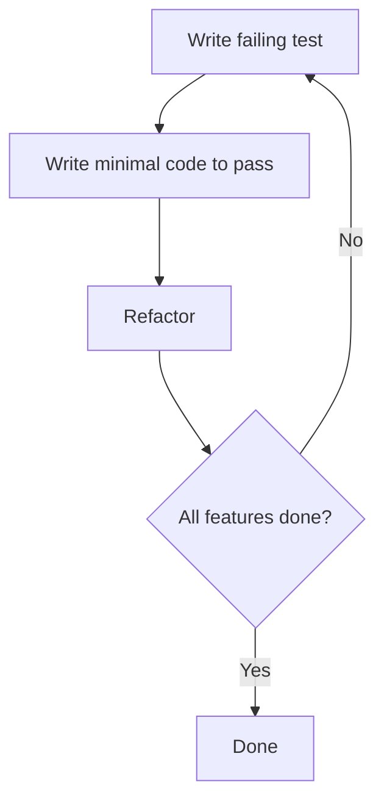

# CometVisu-KnxD FastCGI Backend — Project Plan

## 1. Overview

This project implements a **FastCGI backend** in **modern C++ (C++20)** that bridges
the [CometVisu Protocol](https://github.com/CometVisu/CometVisu/wiki/Protocol)
to a locally running [knxd](https://github.com/knxd/knxd) daemon.

The backend runs as a **single FastCGI process** and handles the three
CometVisu endpoints:

| Endpoint | HTTP Method | Purpose                  | Status |
|----------|-------------|--------------------------|--------|
| `/l`     | GET         | Login / session          | ✅     |
| `/r`     | GET         | Read (long-poll / COMET) | ✅     |
| `/w`     | GET         | Write                    | ✅     |
| `/f`     | POST/PUT/DELETE | Filter management    | 🔜 deferred |

It communicates with knxd via its **Unix domain socket** (default: `/run/knx`)
using the **eibd client binary protocol**.

---

## 2. Architecture

```
┌──────────────┐     HTTP/FCGI      ┌─────────────────────┐     eibd binary      ┌─────────┐
│  CometVisu   │ ◄────────────────► │  cometvisu-knxd-fcgi │ ◄──────────────────► │  knxd   │
│  (browser)   │   JSON/FCGI        │  (this project)      │   over Unix socket   │         │
└──────────────┘                    └─────────────────────┘                      └─────────┘
```

### Internal Component Diagram

```
┌──────────────────────────────────────────────────────────┐
│                     Main Process                          │
│                                                          │
│  ┌──────────┐   ┌───────────────┐   ┌─────────────────┐ │
│  │ FCGI     │   │   Request     │   │   Knxd Client   │ │
│  │ Listener │──►│   Router      │──►│   (non-blocking) │ │
│  │          │   │               │   │                 │ │
│  │          │   │               │   │                 │ │
│  └──────────┘   │  /l → Login   │   │  connect()      │ │
│                 │  /r → Read    │   │  send group msg │ │
│                 │  /w → Write   │   │  recv group msg │ │
│                 └───────────────┘   └─────────────────┘ │
│                        │                                 │
│                        ▼                                 │
│                 ┌───────────────┐                        │
│                 │   Response    │                        │
│                 │   Builder     │                        │
│                 │   (JSON)      │                        │
│                 └───────────────┘                        │
│                                                          │
│  ┌─────────────────────────────────────────────────────┐ │
│  │              State / Cache                           │ │
│  │  - Session store (session_id → metadata)            │ │
│  │  - Address cache (group_addr → last value + time)   │ │
│  │  - Long-poll waiters (group_addr → list of FCGI req)│ │
│  └─────────────────────────────────────────────────────┘ │
└──────────────────────────────────────────────────────────┘
```

---

## 3. Protocol Details

### 3.1 CometVisu Protocol (summary)

#### Login (`GET /l`)
- Optional query params: `u` (user), `p` (password), `d` (device)
- Response: `{"v":"1.0","s":"SESSION_ID"}`
- Anonymous sessions: session ID is `"0"`

#### Read (`GET /r`)
- Query params: `s` (session), `a` (address, repeatable), `t` (timeout), `i` (index)
- Address format: `NAMESPACE:VALUE` — e.g. `KNX:1/2/3`
- Timeout semantics:
  - Omitted → long-poll (COMET): hold connection via **poll()** on knxd fd,
    zero-CPU wait until data arrives or configurable timeout expires
  - `t=0` → read from bus NOW (blocking read via knxd cache)
  - `t>0` → return cached data ≤ `t` seconds old; if none, read bus
  - `t<0` → return cached data only, never read bus
- Response: `{"d":{"ADDRESS":VALUE,...},"i":"INDEX"}`
- KNX values are hex strings, e.g. `"0c6f"` for DPT 9.001 (22.07°C)

#### Write (`GET /w`)
- Query params: `s` (session), `a` (address), `v` (value)
- Value is hex string for KNX
- Response: empty body; HTTP status 200/401/403/404

### 3.2 knxd/eibd Client Protocol (summary)

Communication over Unix socket (`/run/knx`):

```
┌──────────┬──────────────────┐
│ 2 bytes  │  N bytes         │
│ length   │  payload         │
│ (big-end)│                  │
└──────────┴──────────────────┘
```

Payload format for group operations:

| Operation          | Type (2 bytes) | Additional fields            |
|--------------------|----------------|------------------------------|
| Open Group Socket  | `0x0026`       | 1 byte: write_only flag      |
| Send Group Packet  | `0x0027`       | 2 bytes: dest addr + APDU    |
| Recv Group Packet  | `0x0025`       | 2 bytes: src addr + APDU     |
| Cache Read         | `0x0200`       | 2 bytes: dest addr           |
| Cache Read Response| `0x0200`       | 4 bytes: src+dest addr + data|

**Group address**: 16-bit value. KNX three-level `a/b/c` maps to `(a << 11) | (b << 8) | c`.

**APDU format** (for group value):
- Byte 0: `0x00`
- Byte 1: bits 7-6 = type (0=Read, 1=Response, 2=Write), bits 5-0 = data LSB
- Bytes 2+: additional data bytes

**URL format** for knxd connection: `local:/run/knx`

---

## 4. TDD Strategy



### Test Layers (bottom-up)

1. **Unit tests** — individual components, mocked dependencies
   - Knx address parsing / formatting
   - APDU encoding / decoding
   - Hex string ↔ binary conversion
   - URI query string parsing
   - JSON request / response building

2. **Integration tests** — components with real knxd (or mock socket)
   - KnxdClient: connect, groupWrite, groupRead, groupListen
   - RequestRouter: dispatch to correct handler
   - Cache: store/retrieve values, timeout logic
   - Long-poll: wake on new data

3. **End-to-end tests** — full FCGI request/response cycle
   - Login flow
   - Read flow (cached, bus-read, long-poll)
   - Write flow
   - Error cases (bad address, missing params)

### Testing Tools
- **Google Test** (gtest) — C++ test framework
- **Google Mock** (gmock) — mocking framework
- **Test fixtures** for knxd mock socket

---

## 5. Project Structure

```
cometvisu-knxd-fcgi/
├── CMakeLists.txt                  # Top-level build
├── PLAN.md                         # This file
├── AGENTS.md                       # Instructions for LLM agents
├── .clang-format                   # Code style
├── .clang-tidy                     # Static analysis
├── .gitignore
├── README.md
├── src/
│   ├── CMakeLists.txt
│   ├── main.cpp                    # Entry point: FCGI accept loop
│   ├── fcgi/
│   │   ├── CMakeLists.txt
│   │   ├── fcgi_server.h/.cpp      # FastCGI protocol implementation
│   │   └── fcgi_request.h/.cpp     # Parsed FCGI request
│   ├── router/
│   │   ├── CMakeLists.txt
│   │   ├── router.h/.cpp           # URL router → handler dispatch
│   │   └── handler.h               # Handler interface
│   ├── handlers/
│   │   ├── CMakeLists.txt
│   │   ├── login_handler.h/.cpp    # GET /l → session
│   │   ├── read_handler.h/.cpp     # GET /r → read values
│   │   └── write_handler.h/.cpp    # GET /w → write values
│   ├── knxd/
│   │   ├── CMakeLists.txt
│   │   ├── knxd_client.h/.cpp      # Unix socket client for knxd
│   │   └── knxd_protocol.h/.cpp    # eibd protocol encoding/decoding
│   ├── state/
│   │   ├── CMakeLists.txt
│   │   ├── session_store.h/.cpp    # Session management
│   │   ├── address_cache.h/.cpp    # Cached KNX values with TTL
│   │   └── long_poll.h/.cpp        # Long-poll waiter management
│   └── util/
│       ├── CMakeLists.txt
│       ├── query_string.h/.cpp     # URL query parameter parser
│       ├── json_builder.h/.cpp     # Minimal JSON builder
│       └── hex.h/.cpp              # Hex string ↔ byte conversion
├── tests/
│   ├── CMakeLists.txt
│   ├── unit/
│   │   ├── CMakeLists.txt
│   │   ├── test_query_string.cpp
│   │   ├── test_hex.cpp
│   │   ├── test_knxd_protocol.cpp
│   │   ├── test_knxd_address.cpp
│   │   ├── test_json_builder.cpp
│   │   ├── test_session_store.cpp
│   │   ├── test_login_handler.cpp
│   │   └── test_address_cache.cpp
│   ├── integration/
│   │   ├── CMakeLists.txt
│   │   ├── test_knxd_client.cpp
│   │   ├── test_read_handler.cpp
│   │   └── test_write_handler.cpp
│   └── e2e/
│       ├── CMakeLists.txt
│       └── test_full_flow.cpp
├── mocks/
│   ├── CMakeLists.txt
│   └── mock_knxd_socket.h/.cpp     # Fake knxd socket server
└── vendor/                          # Third-party (fetched by CMake)
    └── (googletest via FetchContent)
```

---

## 6. Build System

- **CMake** 3.20+ with C++20
- Dependencies:
  - `libfcgi-dev` or bundled FastCGI library
  - Google Test (fetched via `FetchContent`)
- Build commands:
  ```bash
  cmake -B build -DCMAKE_BUILD_TYPE=Debug
  cmake --build build
  ctest --test-dir build --output-on-failure
  ```

---

## 7. Implementation Phases

### Phase 1: Foundation ✅
- [x] Project skeleton, CMake, googletest integration
- [x] Utility classes: `QueryString`, `Hex`, `JsonBuilder`
- [x] Unit tests for all utilities

### Phase 2: knxd Protocol ✅
- [x] `KnxdProtocol`: address encoding, APDU encoding/decoding
- [x] `KnxdClient`: Unix socket connect, send, receive
- [x] **Non-blocking I/O**: `set_nonblocking()` via `fcntl O_NONBLOCK`, `get_fd()`
- [x] Mock knxd socket for testing
- [x] Unit tests + integration tests

### Phase 3: FastCGI Server ✅
- [x] FCGI protocol implementation (libfcgi)
- [x] `FcgiServer` accept loop, `FcgiRequest` parsing
- [x] Integration tests with test HTTP client

### Phase 4: Core Handlers ✅
- [x] `LoginHandler` — session creation with secure random IDs
- [x] `ReadHandler` — cached/bus/long-poll reads with poll()-based wait
- [x] `WriteHandler` — bus writes
- [x] **Session validation**: 401 responses for invalid sessions
- [x] Integration tests for each handler (including error cases)

### Phase 5: State Management ✅
- [x] `SessionStore` — session lifecycle, secure random IDs (`mt19937_64`)
- [x] `AddressCache` — value caching with TTL
- [x] `LongPoll` — COMET long-poll management

### Phase 6: Integration & Polish ✅
- [x] `Router` — URL dispatch
- [x] End-to-end tests
- [x] Error handling: safe timeout parsing, proper HTTP status codes
- [x] Logging, configuration via environment variables

### Phase 7: Future / Deferred
- [ ] Filter endpoint (`/f`) — POST/PUT/DELETE for batch address management
- [ ] TLS support
- [ ] Authentication (user/password validation)
- [ ] Clang-tidy / clang-format CI enforcement
- [ ] Performance benchmarks
- [ ] Integration test with real knxd instance

---

## 8. Configuration

Environment variables actually implemented:
| Variable               | Default        | Description                  |
|------------------------|----------------|------------------------------|
| `KNXD_SOCKET`          | `/run/knx`     | Path to knxd Unix socket     |
| `LONGPOLL_TIMEOUT_SEC` | `300`          | Max long-poll hold time      |

---

## 9. KNX Address Mapping

KNX group addresses in three-level notation `a/b/c` map to 16-bit:

```
16-bit addr = (a << 11) | (b << 8) | c
```

CometVisu addresses:
```
KNX:1/2/3   → namespace="KNX", group=1/2/3
KNX:1/2/3   → internal 16-bit: 0x0903
```

Values in CometVisu are hex strings:
```
"0c6f" → bytes [0x0c, 0x6f] → sent as APDU 0x00 0x80 0x0c 0x6f
```
(where 0x80 = A_GroupValue_Write indicator)

---

## 10. AGENTS.md Instructions

This project follows these conventions for LLM-based development:

1. **TDD first**: Write the test, see it fail, then implement.
2. **Modern C++**: Use C++20 features, RAII, `std::optional`, `std::span`,
   `std::string_view`, smart pointers.
3. **No raw owning pointers**: Use `std::unique_ptr` and `std::shared_ptr`.
4. **Header-only where practical**: Utility classes can be header-only.
5. **`.cpp` files for complex logic**: Keep headers lean.
6. **One class per file**: Unless tightly coupled.
7. **Test file naming**: `test_<module>.cpp` in the corresponding test dir.
8. **Commit after each passing test**: Small, focused commits.
9. **Clang-format**: Run before committing. Style: Google-based with 100 char
   line limit.
10. **Error handling**: Use `std::expected` (C++23 via `tl::expected` or
    exceptions with `noexcept` where appropriate). For this project, use
    exceptions for unexpected errors and return values for expected failures.

---

## 11. Current Status (2026-07-04)

### Test Suite: 12 tests, all passing

| Layer | Tests | Details |
|-------|-------|---------|
| Unit  | 8     | query_string, hex, knxd_protocol, knxd_address, json_builder, session_store, login_handler, address_cache |
| Integration | 3 | knxd_client, read_handler, write_handler |
| E2E   | 1     | full_flow (login, read, write, router dispatch, cache integration) |

### Key Design Decisions Implemented

1. **Non-blocking I/O**: KnxdClient uses `fcntl O_NONBLOCK` + `get_fd()` for `poll()` integration.
   Long-poll in ReadHandler uses `::poll()` on the knxd fd — the kernel puts the
   process to sleep until data arrives or timeout, burning zero CPU.

2. **Session validation**: Both `/r` and `/w` validate the `s=` parameter. Invalid
   sessions return HTTP 401. Anonymous session `s=0` is always accepted.
   Session check happens _after_ parameter validation (400 > 401 priority).

3. **Secure session IDs**: `mt19937_64` PRNG seeded from `std::random_device`,
   producing 16-char hex strings. Not predictable like sequential counters.

4. **Safe parsing**: `ReadHandler::parse_timeout()` returns `std::optional<int>`,
   catching `std::invalid_argument` and `std::out_of_range`. Trailing garbage
   (e.g. `t=5abc`) is rejected.

5. **Mock-driven testing**: `KnxdClientInterface` with `MockKnxdClient` enables
   testing all handlers without a real knxd instance.

### What's Deferred

- **Filter endpoint** (`/f`): POST/PUT/DELETE for batch address management per
  CometVisu protocol. Not needed for basic read/write operation.
- **TLS**: All communication should be behind a TLS-terminating reverse proxy.
- **Authentication**: Login accepts any user/password and creates a session.
  Real auth would require a user database or PAM integration.
- **Production hardening**: log rotation, signal handling, resource limits,
  daemonization.
